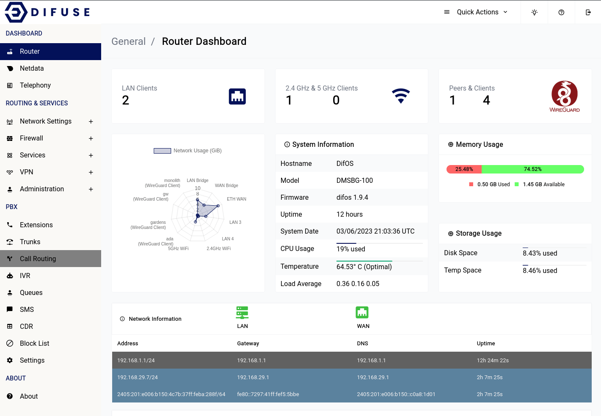

# Dashboard - Router 

The Router dashboard provides a comprehensive bird's eye view of your network infrastructure. From device load to VPN status, WiFi details to IP addressing, the Router dashboard gives you all the relevant information you need to quickly assess the health and performance of your device and network.

At Difuse, we understand the importance of having a clear and concise overview of your network infrastructure. That's why our Router dashboard is designed to provide you with all the critical information you need in a single, easy-to-use interface.

## Key Metrics

The Router dashboard displays key metrics such as:

- Number of wired LAN clients
- WiFi client details (including how many are connected to 2.4 GHz vs. 5 GHz)
- Current IP addresses configured on the system

## Quick Actions

Located in the top-right corner of the page, the "Quick Actions" menu provides easy access to frequently used tasks, such as:

- Restarting or reloading the Asterisk instance
- Rebooting the router

### Info

Please keep in mind that it will take a couple of minutes for the router to be active after a reboot depending on the services that you have enabled/are in use.

<!-- Placeholder for Photo: Replace with an image related to Router dashboard -->

